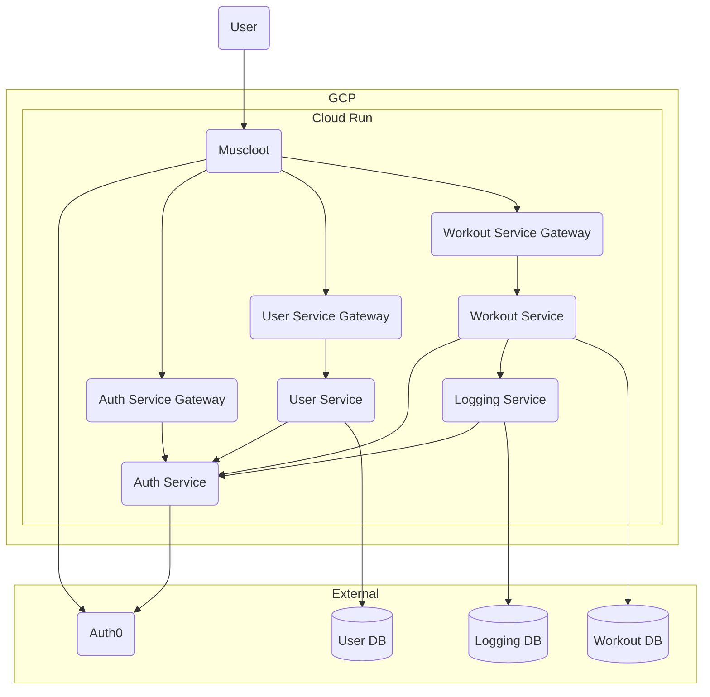

# Muscloot

- [Muscloot Frontend](https://github.com/qkitzero/muscloot-frontend)
- [Auth Service](https://github.com/qkitzero/auth-service)
- [User Service](https://github.com/qkitzero/user-service)
- [Workout Service](https://github.com/qkitzero/workout-service)
- [Logging Service](https://github.com/qkitzero/logging-service)

